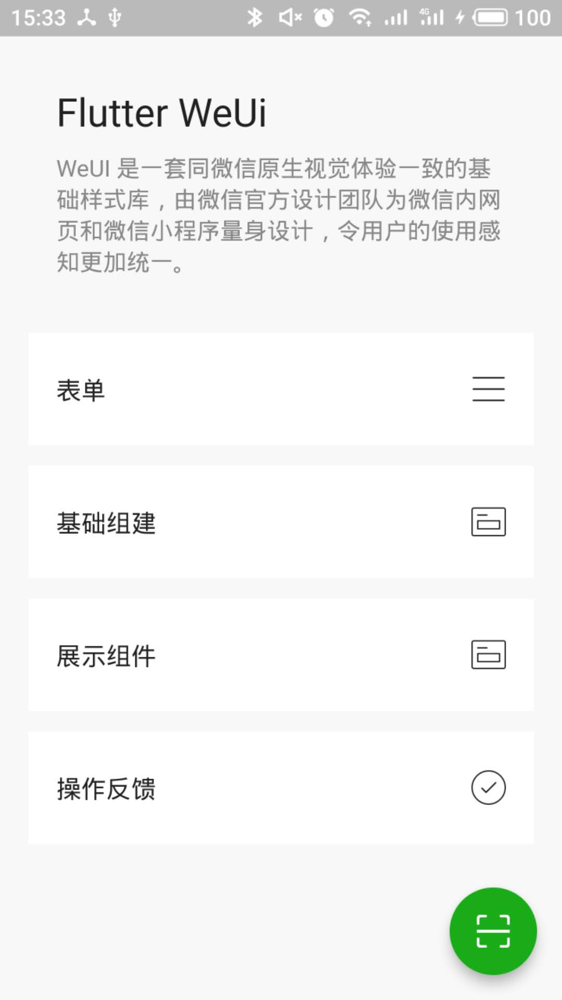
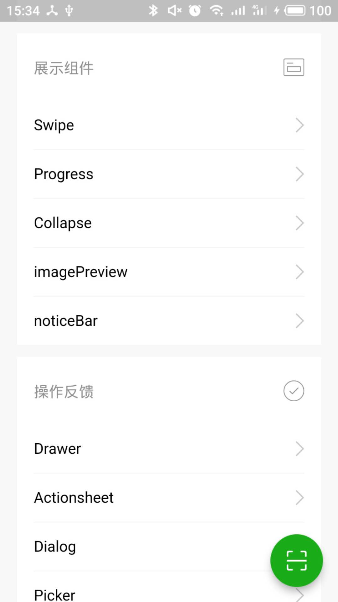
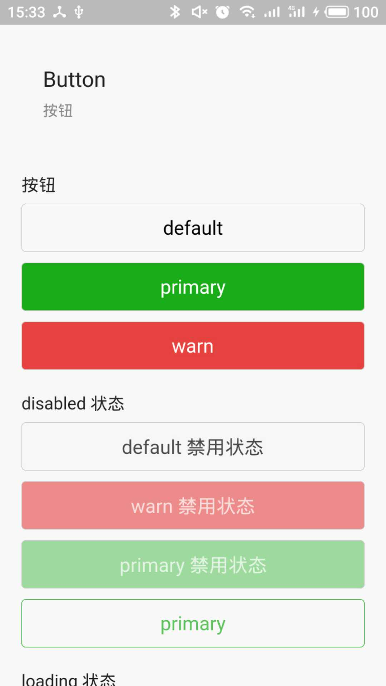

# flutter_weui
[](https://pub.dartlang.org/packages/weui)

#### 用flutter实现的weui框架, 实现了weui大部分的组件, 同时支持android 和 ios, 欢迎大家使用和交流

## 预览图
&nbsp;&nbsp;

<br />
<br />
&nbsp;&nbsp;


## 安装
```
flutter_weui: 0.0.1
```

## 如何运行案例
#### 1. clone 代码
```
git clone https://github.com/allan-hx/flutter-weui.git
```

#### 2. 安装依赖
```
flutter packages get
```

#### 3. 进入flutter-weui-example目录 执行以下命令
```
flutter run
```

## 后续计划
- [ ] 文档编写
- [ ] 代码优化
- [ ] pick和upload组件开发
